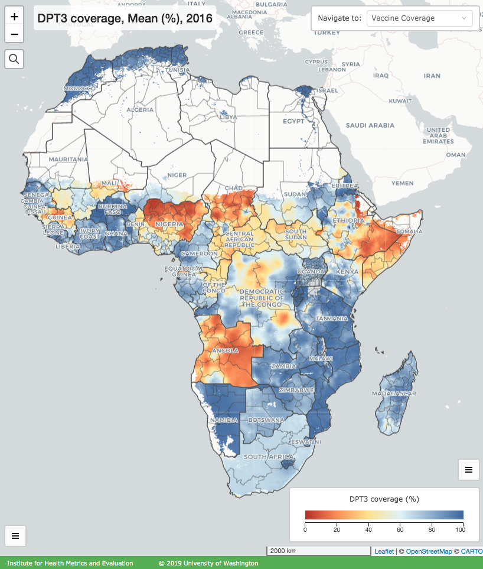
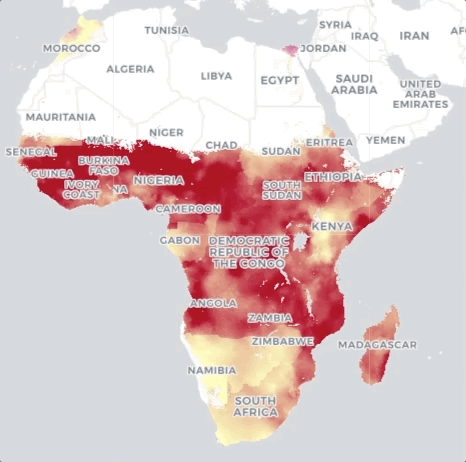

# Visualizing Geospatial Pixel Data with Leaflet and WebGL

by David Schneider, Sofware Engineer at IHME

For [IHME](http://www.healthdata.org/)'s [Local Burden of Disease](http://www.healthdata.org/lbd) project we produce raster datasets showing the geographical distribution of diseases, medical interventions, and other measures. Each pixel represents our researchers' best estimate of the value of a given measure, expressed as a floating-point number, for an area representing roughly a 5km by 5km square. To visualize these data points, we colorize pixels using linear color scales, translating each floating-point value to a color via linear interpolation. Here, for example, is a pixel map representing vaccine coverage in Africa. Looking at the legend in the lower right corner, you can see that data values ranging from 0.0 to 100.0 are mapped to colors ranging from red-orange to blue, with some other colors in between.



Rendering this pixel data efficiently in our [web visualization tool](https://vizhub.healthdata.org/lbd) (shown above) proved to be an interesting problem. This article describes the challenges we faced and how we addressed them.

## First Approach: Map tiles rendered server-side with Carto

Our first approach to producing colorized raster map tiles leveraged the "location intelligence platform" [Carto](https://carto.com/). Carto provides, among other things, a map tile server that is capable of the sort of pixel colorization via linear interpolation that we needed. While setting up a custom instance of Carto's open-source platform was far from easy, its capabilities served our needs well for a time. We were able to give the tile server a SQL query for generating map tiles from data in our custom [PostGIS](http://postgis.net/) database along with some rules for how to colorize the pixels. The server would then return to our browser-based visualization colorized map tiles as PNG images, and we displayed these tiles using the mapping framework [Leaflet](https://leafletjs.com/).

Over time we grew dissatisfied with this approach, however. Not only was Carto challenging to set up and maintain, particularly in our [containerized microservice implementation](https://github.com/ihmeuw/cartodb-docker), but the tile server was quite slow at producing the colorized map tiles, making using the visualization tool a frustrating experience. We did some performance testing of the server with [Apache Jmeter](https://jmeter.apache.org/) and found that it was taking about 3 seconds, in the best case, to return a tile. I suspect we could have squeezed better performance out of the tile server with some optimizations, but its codebase was always something of an impenetrable black box to us, and the prospect of searching for needles in this haystack seemed quite daunting.

## The Idea: Client-side rendering with WebGL

Around this time, I began thinking about other ways to render our map tiles. One option was to create our own tile server to do the colorization. A custom server could be better suited to our specific needs, and, crucially, we'd be more able optimize its performance because we'd understand it better. Yet a server-side solution had some inherent limitations. Rendering a large number of pixels on the CPU is bound to be slow, because the pixels must be processed sequentially (or with limited parallelization taking advantage of multicore architecture). With commodity hardware and the VMs in which our containerized services run, there would be hard limits on how fast the tiles could be produced. It seemed to me that the ideal way to render the images was on the [GPU](https://en.wikipedia.org/wiki/Graphics_processing_unit), which is specifically designed to process large numbers of pixels in parallel. Fortunately, modern browsers provide a way to do GPU processing: [WebGL](https://developer.mozilla.org/en-US/docs/Web/API/WebGL_API)! A WebGL solution would mean the tile server would have very little to do - just retrieve pixel data from PostGIS and then pass it in essentially raw form to the client. The user's browser would then be responsible for actually colorizing the pixels, and it could take advantage of GPU rendering to do this very efficiently.

Having the raw floating-point pixel values available clientside would have another advantage as well - allowing the user quick access to the actual pixel-level estimates in the visualization. While humans generally have a pretty keen color sense, the result of mentally translating a color from a gradient back to the value it's supposed to represent seemed pretty imprecise. Our visualization already had the capability of getting the data value of a given pixel when clicked by the user, but doing so required a backend request and was therefore relatively slow. Having this data available clientside would mean we could retrieve and display these values very quickly.

## Problem 1: Reading floats from a texture in a WebGL shader

The first and most important hurdle I foresaw with this new approach was a limitation of WebGL 1.0: the lack of support for floating-point textures. A "texture," in graphics parlance, is essentially an image you pass to the GPU. Once a texture is loaded, you can read any pixel or pixels you like from it in your shader, which is a small user-defined program that runs on the GPU. WebGL 1.0, by far the most widely implemented version of the standard, allows you to create textures using a variety of pixel types, like RGB and RGBA, but unless the extension `OES_texture_float` is enabled for a user's hardware and browser, it's not possible to use a texture in which the pixels represent floats. WebGL 2.0 adds support for float textures, but our analytics indicated that many of the users of our tool didn't have the capability of using WebGL 2.0.

Luckily, there was another possibility. An RGBA pixel is supposed to represent four color "channels" (red, green, blue, and alpha - aka. opacity), each of which is a single byte (i.e. 8 bits). This gives us 32 bits total to work with per pixel, exactly the space needed to store a single 32-bit floating point value! In principle, therefore, we could encode one float per pixel, feed this raw binary data to WebGL, and then decode the floats in the shader code. Using JavaScript's TypedArrays, it's trivial to create binary data representing a sequence of floats, then reinterpret this data as 8-bit unsigned integers in order to "trick" WebGL into accepting it as RGBA pixel data:

```javascript
// construct the pixel data
const floatArray = new Float32Array([ /* pixels */ ]);
const uintArray = new Uint8Array(floatArray.buffer);

// bind the pixel data to a WebGL texture
gl.texImage2D(
  gl.TEXTURE_2D,    // target
  0,                // mipmap level
  gl.RGBA,          // internal format: 4 color channels
  width,            // width of texture in pixels
  height,           // height of texture in pixels
  0,                // border: must be 0
  gl.RGBA,          // format: must be the same as internal format
  gl.UNSIGNED_BYTE, // type: 8 bits per channel
  uintArray,        // pixels
);
```

The hard part is decoding the pixels in the shader code. GLSL 1.00, the shader language used in WebGL 1.0, doesn't even provide any bitwise operators, so one has to resort to ordinary arithmetic for parsing the binary data. My general approach was to decompose the four 8-bit integers representing the RGBA channels into an array of 32 bits, then compute the floating point value from these raw bits. With frequent references to the [IEEE Standard for Floating-Point Arithmetic (IEEE 754)](https://en.wikipedia.org/wiki/IEEE_754), some trial and error (few tools exist for debugging shader code), and a lot of perseverance, I finally succeeded. If you're curious, you can see my solution [here](https://github.com/ihmeuw/glsl-rgba-to-float/blob/master/index.glsl).

Once a pixel's float value is decoded in the shader, it's pretty easy to [colorize it by applying a linear color scale](https://github.com/ihmeuw/leaflet.tilelayer.glcolorscale/blob/master/src/shaders/util/computeColor.glsl). GLSL even provides a built-in function, `mix`, to do the linear interpolation. So convenient!

## Problem 2: Getting raw pixel data to the client

Once I had a working prototype of the WebGL renderer, I turned my attention server-side to figure out how we would pass the floating-point pixel data to the client. The source of this data was our PostGIS database. PostGIS extends the popular [PostgreSQL](https://www.postgresql.org/) [RDBMS](https://en.wikipedia.org/wiki/Relational_database#RDBMS) with geospatial capabilities. It defines a `raster` type for pixel data, with a few different [output formats](https://postgis.net/docs/RT_reference.html#Raster_Outputs) available:
- "Well-Known Binary" (WKB) - essentially the same binary representation PostGIS uses internally
- GeoTIFF - geospatial extension of the common TIFF format
- JPEG
- PNG

Of these choices, JPEG and PNG were unacceptable, because as implemented by PostGIS, they don't support floating-point pixels. JPEG is also a lossy format, and we didn't want to lose any data. GeoTIFF would work, because it's lossless and supports floating-point pixels, but the format is rather complicated, and I suspected it wouldn't be trivial to parse. Ultimately I opted for WKB, because its definition was simpler and I figured it would be faster for PostGIS to produce, because no format conversion would be needed. I couldn't find any existing tools for parsing this format, but the [definition](https://github.com/postgis/postgis/blob/svn-trunk/raster/doc/RFC2-WellKnownBinaryFormat) was pretty straightforward, so it wasn't too difficult to write my own [parser](https://github.com/ihmeuw/wkb-raster).

With the floating-point pixel data extracted from PostGIS, I just needed a way to get it to the client. There were many possibilities for the interchange format, but I chose PNG, primarily because it seemed to be the most common format for raster data on map tile servers. Ordinarily, PNGs treat pixels as RGB or RGBA color channels, but I took inspiration from a common approach to creating [Digital Elevation Model (DEM)](https://en.wikipedia.org/wiki/Digital_elevation_model) tiles, whereby values that don't represent colors are encoded into the RGBA channels (or more abstractly the 32 bits) of each pixel. Our PNG tiles would be a bit different from DEM tiles, because we needed to encode 32-floats, whereas DEM PNGs typically encode 32-bit integers. Still, the basic idea is the same - using the 32 bits available for each pixel to encode some value that doesn't represent a color. Astute readers should also recognize this as the same approach we used for encoding floats in a WebGL texture. One bonus to using PNG is that the format provides lossless compression. The compression scheme is designed for RGB(A), so it doesn't work as well for compressing floats, but it's still better than no compression.

## Problem 3: Integrating with Leaflet

By this point, I had a working prototype spanning the full stack. To summarize:
- server:
  - query PostGIS for floating-point raster data
  - parse the result, extracting the raw pixels
  - pack the pixels into a PNG tile and send to the client
- client:
  - extract the pixels from the PNG
  - pass them to WebGL via a texture
  - decode and colorize each pixel in the shader

To go from this prototype to a full implementation that would work in our mapping application, one major hurdle remained: integrating the WebGL rendering into Leaflet.

Leaflet is a popular and flexible JavaScript mapping framework, and one of its greatest strengths is its extensibility. The built-in [TileLayer component](https://leafletjs.com/reference.html#tilelayer) is the standard way of displaying raster tiles in Leaflet. We had already written a custom component extending this tile layer for our prior implementation using Carto. I figured we could do something similar for the new implementation using WebGL, but many questions remained to be answered.

To figure out how best to do this, I spent some time examining the public APIs and interals of both `TileLayer` and `GridLayer` (which the former extends). `GridLayer` maintains a cache of tiles, indexed by `x`, `y`, and `z` (zoom level) coordinates. Based on the user's current view and some configuration settings, `GridLayer` is responsible for deciding when to add or remove tiles, and it controls how these tiles are positioned on the map. The actual tile creation is delegated to a method, `createTile`, that is intended to be overridden in derived classes. Our custom component would need to fetch and render its tiles in `createTile`.

For optimal performance in OpenGL, you typically want to render as much as possible in a single pass or "draw call". I hoped to render multiple tiles per draw call to take best advantage of the hardware, but the design of `GridLayer` necessitated drawing one tile at a time, because `createTile` is called as needed for _each_ tile that must be rendered. There was another issue as well: WebGL rendering is tied to a `canvas` HTML element. So as not to overtax the hardware resources and to prevent costly state changes in the WebGL system, it's best to use just one `canvas` for rendering. Given the design of `GridLayer`, though, which places an HTML element on the DOM _for each tile_, a single `canvas` clearly wouldn't suffice.

Creating a new WebGL context for each new `canvas` added to the DOM seemed too expensive, so I opted instead to create a single offscreen `canvas` used exclusively for WebGL rendering. Each tile would be rendered to this offscreen `canvas` on demand, then the rendered pixels would be copied to a new `canvas` that `GridLayer` would attach to the map. It's not an ideal solution, because when many tiles need to be rendered, many pixels must be copied from the rendering `canvas` to the onscreen `canvas`es, but it seemed the best option available given the design of `GridLayer`.

## Flourishes

By now, the main work was complete, but there were a few more nice-to-have features I was keen to add. First, I wanted to make the floating-point value of the pixel under the cursor available to user-defined mouse events. Since the parent class, `GridLayer`, maintains a cache of the tiles visible onscreen, doing so was pretty easy. I could use the cursor's screen position to determine (1) which tile was under the cursor and (2) the cursor's pixel coordinates within the tile. From there, the float value could be obtained from the binary pixel data with a JavaScript `DataView`:

```typescript
// create a DataView for obtaining a value from the binary pixel data
const tileDataView = new DataView(pixelData.buffer);

// To find the byte index:
// (1) get the index of the start of the row in which the pixel is located
//     (row index * number of columns)
// (2) add to that the column index
// (3) multiply by the number of bytes used for each pixel (4)
const byteIndex = (coordsInTile.y * tileSize + coordsInTile.x) * BYTES_PER_WORD;

// use the byte index and the machine's endianness to obtain the pixel value
const pixelValue = tileDataView.getFloat32(byteIndex, littleEndian);
```

Second, I wanted to animate transitions (per pixel) when the user switched the view to load a new set of tiles. In addition to being a nice visual treat, I thought these transitions could be useful in the Local Burden of Disease visualization for illuminating changes over time. In particular, we typically provide a "play" control that allows users to view data for a series of years in a timed sequence. I found it difficult to perceive the magnitude of changes from year to year when viewing a sequence of static images, which was how we had originally implemented the play feature. I suspected, though, that animated transitions would help draw the eye to areas where more dramatic changes were occurring.



To implement these transitions, I'd need to modify the WebGL renderer. Specifically, two textures would need to be loaded during transitions - one containing the old tiles and one containing the new. The shader code would need to compute the values of pixels in both the old and new tiles and interpolate between them over time. There were multiple cases to account for, because it was possible to (1) change the tiles but keep the colorization rules the same, and (2) change the tiles and the colorization rules. A third option would be to keep the same tiles but change the colorization rules, but since this wasn't possible in the Local Burden of Disease application, I decided to defer implementing it until it was actually needed.

When changing the tiles but maintaining the colorization rules, we could interpolate between the floating-point values of each pixel in the old and new tiles, then compute the color of the interpolated value. This would mean each pixel would transition along the linear gradient(s) defined for the color scale.

```glsl
// retrieve and decode pixel value from the old tile
vec4 rgbaFloatsA = texture2D(textureA, vTexCoordA);
float pixelFloatValueA = rgbaToFloat(rgbaFloatsA, littleEndian);

// retrieve and decode pixel value from the new tile
vec4 rgbaFloatsB = texture2D(textureB, vTexCoordB);
float pixelFloatValueB = rgbaToFloat(rgbaFloatsB, littleEndian);

// interpolate
float interpolated = mix(pixelFloatValueA, pixelFloatValueB, interpolationFraction);

// compute the color of the interpolated value
gl_FragColor = computeColor(interpolated, colorScale, sentinelValues, colorScaleLength, sentinelValuesLength);
```

When changing both tiles and colorization rules, though, this approach wouldn't work, because old and new tiles needed to be colorized according to different rules. In this case, we'd need to compute the color of each pixel in the old tiles and each pixel in the new tiles and then interpolate (in RGB color space) between the _colors_.

```glsl
// ... obtain old and new pixel values as before

// compute the color of the old pixel
vec4 colorA = computeColor(pixelFloatValueA, colorScaleA, sentinelValuesA, colorScaleLengthA, sentinelValuesLengthA);

// compute the color of the new pixel
vec4 colorB = computeColor(pixelFloatValueB, colorScaleB, sentinelValuesB, colorScaleLengthB, sentinelValuesLengthB);

// interpolate between the colors
gl_FragColor = mix(colorA, colorB, interpolationFraction);
```

Note that I've simplified the shader code here for the purpose of highlighting the basic concepts. For curious readers, here are the actual implementations for [interpolating by value](https://github.com/ihmeuw/leaflet.tilelayer.glcolorscale/blob/master/src/shaders/interpolateValue.frag.glsl) and [interpolating by color](https://github.com/ihmeuw/leaflet.tilelayer.glcolorscale/blob/master/src/shaders/interpolateColor.frag.glsl).

## Outcome

The new approach to fetching and rendering map tiles in the LBD application yielded encouraging results in terms of performance and usability. Tile requests now complete much faster - generally in less than a second, compared with 3+ seconds in the prior implementation. This makes using the tool in geospatial (i.e. raster) mode a smoother experience, eliminating the frustration of having to wait a long time for map tiles to load. Seeing pixel values on mouse hover allows users immediate and continuous access to the estimates being visualized. And animated per-pixel transitions make the changes between one view and another easier to perceive, particularly helpful for visualizing changes over time.

After implementing this solution in the LBD application, I extracted and published the major components as open-source software:
- JavaScript parser for the PostGIS WKB raster type: [wkb-raster](https://github.com/ihmeuw/wkb-raster)
- GLSL shader function for parsing 32-bit floats from RGBA vectors: [glsl-rgba-to-float](https://github.com/ihmeuw/glsl-rgba-to-float)
- Leaflet tile layer: [Leaflet.TileLayer.GLColorScale](https://github.com/ihmeuw/leaflet.tilelayer.glcolorscale)
